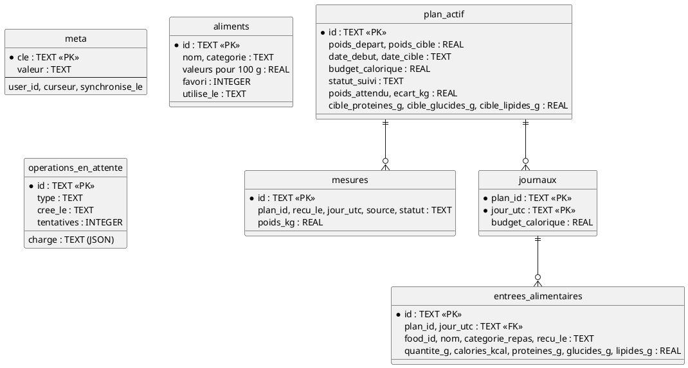
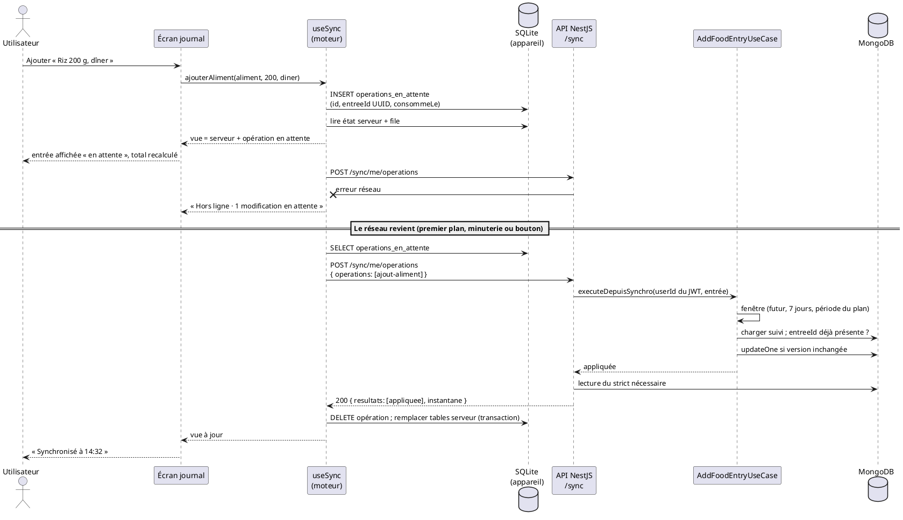
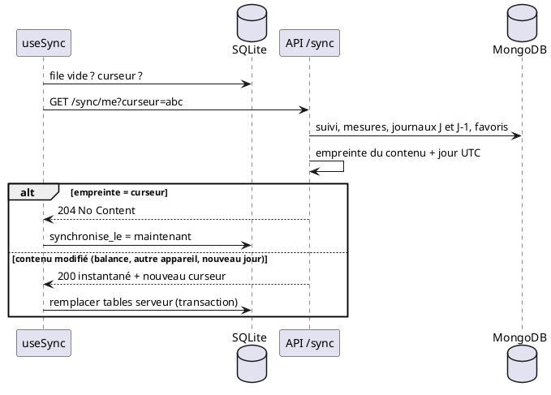
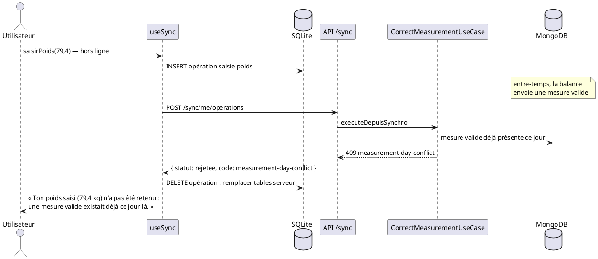

# Page 9 — Synchronisation

L’application mobile embarque une base **SQLite** (`expo-sqlite`) synchronisée
**dans les deux sens** avec MongoDB. L’utilisateur consulte son suivi, ajoute ou
retire des aliments, saisit son poids de secours et gère ses favoris **même sans
réseau** ; les modifications partent dès que la connexion revient.

## 1. Principes

| Principe | Mise en œuvre |
| --- | --- |
| Strict nécessaire | La base locale ne contient que ce que l’utilisateur voit à l’écran (voir §2). Le référentiel complet des aliments n’est pas copié. |
| Le serveur fait autorité | Toute modification locale est rejouée par l’API **avec les mêmes règles métier** que les routes en ligne. Ce que le serveur refuse est retiré de l’appareil et expliqué à l’utilisateur. |
| Lecture locale d’abord | Les écrans lisent uniquement la base embarquée : affichage immédiat, hors ligne compris. |
| Écriture locale d’abord | Une action écrit dans une file d’attente locale (*outbox*) puis déclenche une synchronisation. |
| Idempotence | Les identifiants (opération, entrée alimentaire, mesure) sont générés sur l’appareil (UUID v4). Rejouer une opération déjà traitée ne crée pas de doublon. |
| Échanges minimaux | 1 requête par cycle : `push` renvoie l’instantané à jour ; sans modification, `pull` renvoie **204 sans corps** si rien n’a changé (curseur). |

Le rôle **coach** reste en ligne : il prépare des plans et ne saisit pas de suivi.

## 2. Données embarquées

| Donnée | Pourquoi elle est sur l’appareil | Origine |
| --- | --- | --- |
| Plan actif + statut de suivi du poids (attendu, écart) | Écran « Mon suivi de poids » | serveur |
| Mesures des 3 derniers mois | Historique et courbe | serveur |
| Budget calorique et cibles de macros | Journal et budget du jour | serveur |
| Journaux alimentaires d’**aujourd’hui et d’hier** (UTC) | Journal du jour ; le statut alimentaire ne regarde pas plus loin qu’hier | serveur |
| Aliments favoris | Ajout rapide hors ligne | serveur |
| 8 aliments récents | Ajout rapide hors ligne | appareil uniquement |
| Modifications en attente | File d’envoi | appareil uniquement |

Ne sont **pas** embarqués : le référentiel d’aliments (recherche en ligne), les
journaux plus anciens, les données des autres utilisateurs, les jetons (stockés
dans SecureStore, jamais dans SQLite). À la déconnexion, la base est vidée ; à
la connexion d’un autre compte, elle est effacée.

### Schéma SQLite (version 1, migration par `PRAGMA user_version`)



Les tables issues du serveur sont **remplacées** à chaque instantané reçu. Les
modifications en attente ne sont jamais écrites dedans : la vue affichée est
calculée à la lecture (`projection.ts`) = dernier état serveur + opérations en
file. Recevoir un instantané ne fait donc jamais disparaître une saisie pas
encore envoyée.

## 3. API de synchronisation

Routes réservées au rôle `utilisateur` (JWT). L’utilisateur vient toujours du
jeton, jamais du corps de la requête.

| Route | Rôle | Réponses |
| --- | --- | --- |
| `GET /api/sync/me?curseur=…` | **Pull** : instantané du strict nécessaire | `200` instantané · `204` rien n’a changé · `401` · `403` |
| `POST /api/sync/me/operations` | **Push** : rejoue jusqu’à 100 opérations dans l’ordre | `200` `{ resultats, instantane }` · `400` lot invalide · `401` · `403` |

Le **curseur** est une empreinte SHA-256 du contenu de l’instantané et du jour
UTC : un statut qui dépend de la date (« pas de données récentes ») change
aussi le curseur.

### Opérations rejouées

| Type | Champs | Règle appliquée par le serveur |
| --- | --- | --- |
| `ajout-aliment` | `entreeId`, `foodId`, `quantiteGrammes`, `categorieRepas?`, `consommeLe` | Même calcul que l’ajout en ligne. L’heure de consommation de l’appareil est retenue (repas d’hier soir saisi hors ligne → journal d’hier) si elle n’est ni dans le futur (tolérance 5 min), ni plus vieille que 7 jours, ni hors de la période du plan. |
| `retrait-aliment` | `entreeId` | Recalcul des totaux. Entrée introuvable = déjà retirée. |
| `saisie-poids` | `mesureId`, `poidsKg`, `saisiLe` | Saisie de secours **du jour** : refusée si elle arrive un autre jour UTC ou si une mesure valide existe déjà ce jour. Horodatée par le serveur à la réception. |
| `favori` | `foodId`, `favori` | Ajout/retrait idempotent. |

### Résultat par opération

| Statut | Signification | Action de l’appareil |
| --- | --- | --- |
| `appliquee` | Enregistrée | Retire l’opération de la file |
| `deja-appliquee` | Rejeu d’une opération déjà traitée (réponse perdue) | Retire l’opération |
| `rejetee` | Refus métier définitif (`code` + `message`) | Retire et explique à l’utilisateur |
| `a-reessayer` | Conflit de concurrence ou erreur transitoire | Garde ; abandon après 5 tentatives |

## 4. Déclenchement

- ouverture de l’espace utilisateur (après restauration de la session, **même
  hors ligne** : la session enregistrée est reprise sans attendre le réseau) ;
- retour de l’application au premier plan ;
- après chaque modification locale ;
- toutes les 2 minutes tant que l’application est ouverte ;
- bouton « Synchroniser » / « Actualiser ».

Un seul cycle à la fois ; une modification faite pendant un cycle relance un
cycle juste après. Avant la déconnexion, une dernière synchronisation est
tentée ; s’il reste des modifications non envoyées, l’utilisateur est prévenu
et doit confirmer.

## 5. Conflits

| Situation | Résolution |
| --- | --- |
| Même opération envoyée deux fois (réseau coupé avant la réponse) | Identifiants client → `deja-appliquee`, aucun doublon |
| Aliment ajouté puis retiré hors ligne, avant envoi | Les deux opérations s’annulent sur l’appareil, rien n’est envoyé |
| Favori basculé plusieurs fois hors ligne | Seul le dernier choix est envoyé |
| Balance et saisie manuelle le même jour | Règle « une mesure valide par jour » : la saisie hors ligne est rejetée et l’utilisateur en est informé |
| Deux écritures simultanées sur le même suivi | Verrou optimiste (`version` du document `suivis`) côté serveur, nouvel essai automatique puis `a-reessayer` |
| Donnée modifiée ailleurs (autre appareil, balance) | Le prochain instantané remplace la copie locale |

## 6. Diagrammes de séquence

### 6.1 Ajout d’un aliment hors ligne puis retour du réseau



### 6.2 Pull sans modification locale



### 6.3 Saisie de poids hors ligne refusée



## 7. Organisation du code

### API (`api/src/sync`, module d’orchestration hexagonal)

| Fichier | Rôle |
| --- | --- |
| `domain/operation-synchro.ts` | Types des opérations et des résultats |
| `application/use-cases/get-sync-snapshot.use-case.ts` | Compose les use cases existants (suivi du poids, historique, budget, favoris) |
| `application/use-cases/apply-sync-operations.use-case.ts` | Rejoue chaque opération via le use case métier correspondant et classe le résultat |
| `infrastructure/http/sync.controller.ts`, `sync.dto.ts` | Routes, validation Zod, curseur, Swagger |
| `nutrition/domain/services/saisie-differee.ts` | Fenêtre d’acceptation d’une entrée hors ligne |
| `measurements/domain/services/saisie-differee-poids.ts` | Saisie de poids hors ligne : même jour uniquement |

Aucune règle métier n’est dupliquée : `AddFoodEntryUseCase` et
`CorrectMeasurementUseCase` exposent une variante `executeDepuisSynchro`
(identifiant client, idempotence) qui partage le reste de leur code.

### Mobile (`mobile/src/sync`)

| Fichier | Rôle |
| --- | --- |
| `local-store.ts` | Port de la base embarquée |
| `sqlite-store.ts` | Adaptateur SQLite : schéma, migration, requêtes |
| `memory-store.ts` | Adaptateur mémoire pour l’aperçu web (aucune donnée persistée dans le navigateur) |
| `projection.ts` | Vue = état serveur + file ; règle de statut alimentaire reprise du serveur |
| `engine.ts` | Cycle push/pull, lots de 100, gestion des rejets et des tentatives |
| `useSync.ts` | État Zustand, actions des écrans, annulation locale des opérations non envoyées |
| `SyncStatus.tsx`, `presentation.ts` | Bandeau d’état et explication des refus |

## 8. Tests

| Niveau | Fichier | Couvre |
| --- | --- | --- |
| Unitaires API | `saisie-differee*.spec.ts`, `add-food-entry.use-case.spec.ts`, `apply-sync-operations.use-case.spec.ts`, `sync.dto.spec.ts` | Fenêtres temporelles, idempotence, classification des résultats, curseur, validation |
| HTTP API | `sync.controller.spec.ts` | 401/403, 200 puis 204 avec curseur, conversion des dates, 400, Swagger |
| Intégration API (MongoDB réel, sans mock) | `test/sync.integration-spec.ts` | Pull, push, rejeu sans doublon, refus métier, état final de la base |
| Mobile | `src/sync/tests/*.test.ts` | Contrat identique des adaptateurs SQLite (vrai SQL via sql.js) et mémoire, projection, moteur, store |

```bash
pnpm test                       # unitaires API
pnpm test:e2e:local             # intégration (MongoDB de test démarré)
pnpm --dir mobile test          # mobile
```

### Recette sur iPhone

| Action | Résultat attendu |
| --- | --- |
| Se connecter, ouvrir le suivi | « Synchronisé à hh:mm » |
| Activer le mode Avion, rouvrir l’app | Session reprise, données affichées, bandeau « Hors ligne » |
| Ajouter un aliment hors ligne | Entrée visible « en attente », total et statut recalculés |
| Ajouter puis retirer un aliment hors ligne | Rien en attente |
| Désactiver le mode Avion | Bandeau « Synchronisé », entrée confirmée ; visible dans MongoDB |
| Saisir un poids hors ligne alors que la balance a déjà envoyé une mesure valide | Message de refus explicite |
| Se déconnecter avec des modifications en attente | Avertissement, confirmation demandée |
| Se connecter avec un autre compte | Aucune donnée du compte précédent |
